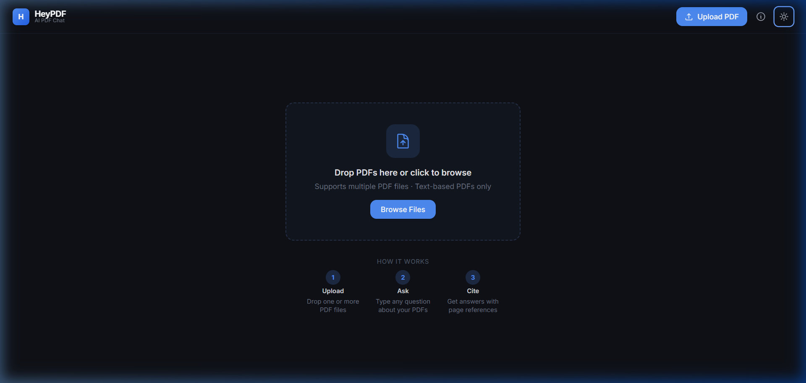
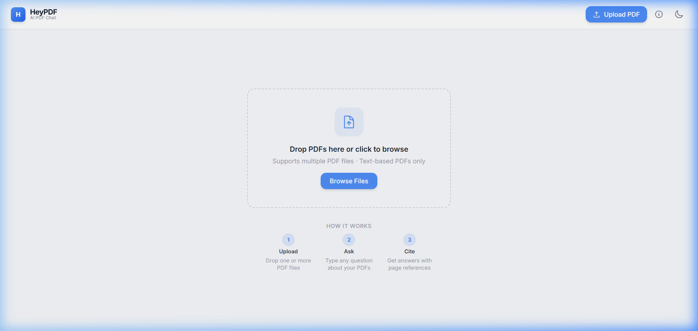

# HeyPDF 2.0 🤖📄

**AI-powered PDF chat with multi-provider key rotation.**  
Upload your PDFs and ask questions. Get answered with page-level citations.

---

## 🖼️ Screenshots

| 🌙 Dark Mode | ☀️ Light Mode |
|:-----------:|:------------:|
|  |  |

---

## ✨ Features

- **Multi-PDF upload** — Upload multiple PDFs at once, toggle each active/inactive for Q&A
- **Semantic Q&A** — FAISS vector search retrieves the most relevant chunks per question
- **Page citations** — Every answer shows which PDF and page it came from
- **Auto-summary** — Each PDF gets a 4-bullet summary and 3 suggested questions on upload
- **Conversation memory** — Last 8 turns are included in every AI prompt
- **Multi-provider key rotation** — Groq → Gemini → OpenRouter → HuggingFace, automatic fallback
- **Dark/Light theme** — Persisted to localStorage
- **Export chat** — Download full Q&A history as `.txt`
- **100% local** — No database, no login, runs on your machine

---

## 🏗️ Tech Stack

| Layer | Technology |
|-------|-----------|
| Frontend | React + Vite + Tailwind CSS |
| Backend | FastAPI (Python) |
| PDF Processing | pdfplumber |
| Embeddings | sentence-transformers (all-MiniLM-L6-v2) |
| Vector Search | FAISS |
| AI Providers | Groq, Gemini, OpenRouter, HuggingFace |

---

## 🚀 Setup Instructions

### 1. Clone / navigate to the project

```bash
cd HeyPDF
```

### 2. Configure API keys

```bash
# Copy the example and fill in your keys
cp .env.example .env
```

Edit `.env` and fill in at least one API key:

| Provider | How to get a free key |
|----------|----------------------|
| **Groq** (recommended, fastest) | https://console.groq.com |
| **Gemini** | https://aistudio.google.com/app/apikey |
| **OpenRouter** | https://openrouter.ai/keys |
| **HuggingFace** | https://huggingface.co/settings/tokens |

Add `_2`, `_3`, etc. keys for more rotation capacity.

### 3. Set up the backend

```bash
cd backend

# Create a virtual environment
python -m venv venv

# Activate it
# Windows:
venv\Scripts\activate
# macOS/Linux:
source venv/bin/activate

# Install pinned dependencies
pip install -r requirements.txt
```

> ⚠️ `sentence-transformers` will download ~90MB model on first run (cached after that).

### 4. Start the backend

```bash
# From the backend/ directory (venv activated)
uvicorn main:app --reload --port 8000
```

API will be available at: http://localhost:8000  
Interactive docs: http://localhost:8000/docs

### 5. Set up and start the frontend

```bash
# In a new terminal, from the project root
cd frontend
npm install
npm run dev
```

Frontend will be available at: http://localhost:5173

---

## 📁 Project Structure

```
HeyPDF/
├── backend/
│   ├── main.py              # FastAPI app + all endpoints
│   ├── pdf_processor.py     # pdfplumber extraction + chunking
│   ├── embeddings.py        # sentence-transformers + FAISS
│   ├── key_manager.py       # Multi-provider AI rotation
│   ├── models.py            # Pydantic schemas
│   ├── storage/             # FAISS indexes (auto-created, gitignored)
│   └── requirements.txt     # Pinned versions
├── frontend/
│   ├── src/
│   │   ├── App.jsx          # Root component + all state
│   │   ├── api.js           # Axios API client
│   │   ├── components/
│   │   │   ├── TopBar.jsx
│   │   │   ├── PDFSidebar.jsx
│   │   │   ├── UploadZone.jsx
│   │   │   ├── ChatWindow.jsx
│   │   │   ├── MessageBubble.jsx
│   │   │   ├── SuggestedQuestions.jsx
│   │   │   ├── AboutModal.jsx
│   │   │   └── Toast.jsx
│   │   └── index.css        # Tailwind + custom styles
│   └── package.json
├── .env                     # Your API keys (not committed)
├── .env.example             # Key format reference
└── README.md
```

---

## 🔑 API Key Rotation

HeyPDF tries providers in this order:

```
Groq (key 1) → Groq (key 2) → Gemini (key 1) → Gemini (key 2)
→ OpenRouter (key 1) → OpenRouter (key 2) → HuggingFace (key 1) → HuggingFace (key 2)
```

Each failure due to quota/rate-limit triggers automatic rotation — logged to console,
completely invisible to the user unless all keys are exhausted.

---

## 📝 API Endpoints

| Method | Endpoint | Description |
|--------|----------|-------------|
| `POST` | `/upload` | Upload + process a PDF |
| `POST` | `/chat` | Ask a question, get answer + citations |
| `GET` | `/pdfs` | List all session PDFs |
| `DELETE` | `/pdfs/{id}` | Delete a PDF |
| `POST` | `/export` | Download chat as .txt |

---

## ⚠️ Known Limitations

- **Scanned PDFs**: Not supported. Text-based PDFs only (pdfplumber can't OCR).
- **Session-based**: Uploaded PDFs are lost when the backend restarts.
- **Model limits**: Free tier rate limits apply. Add more keys to `.env` to increase capacity.
